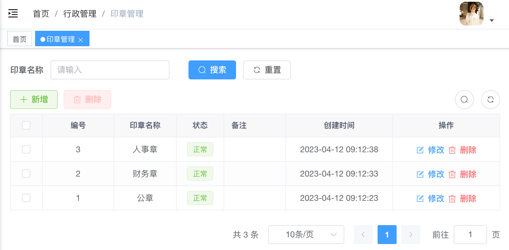
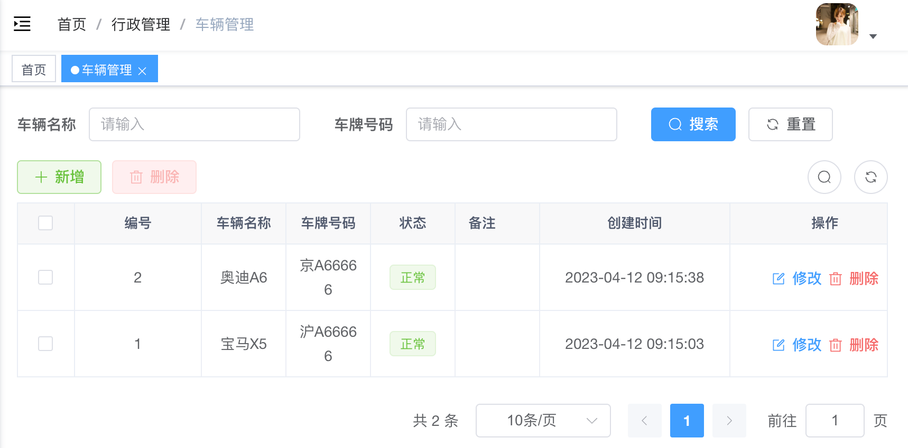
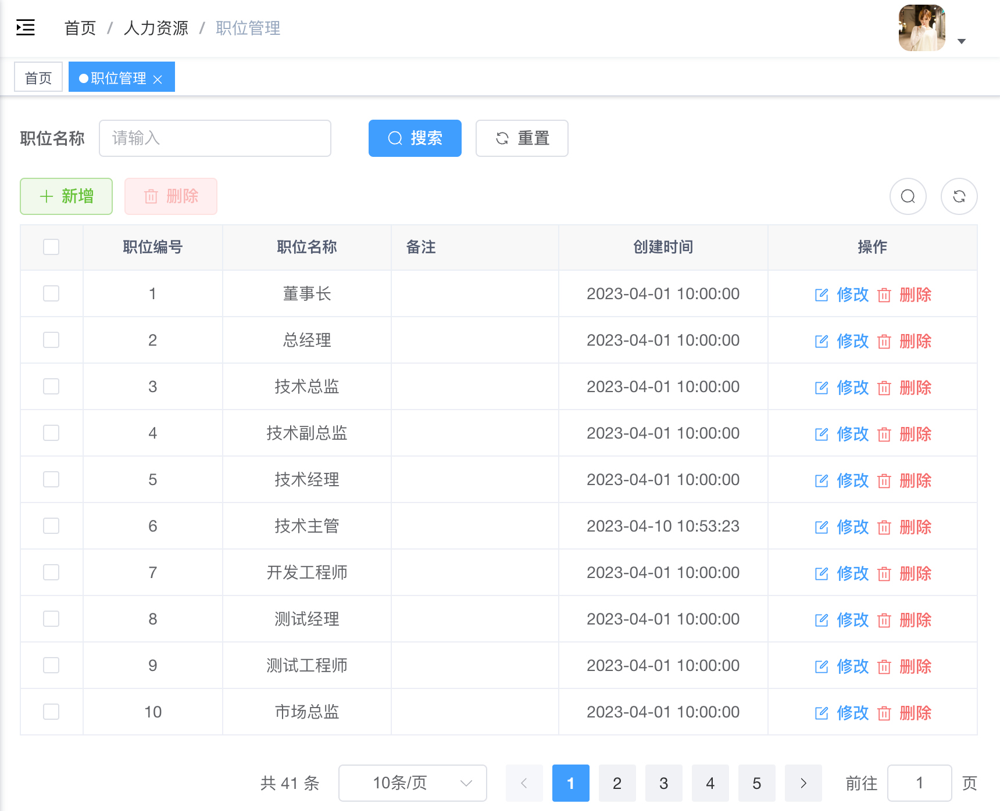
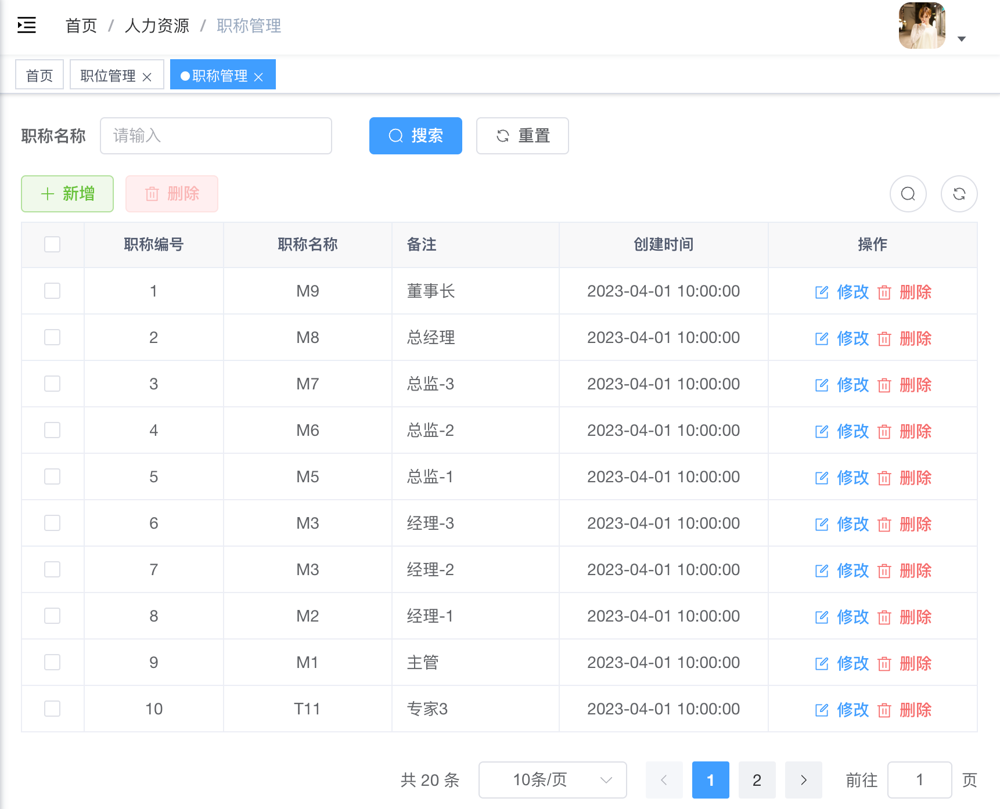
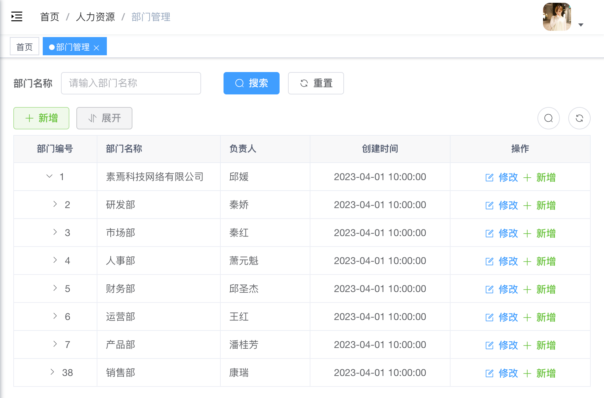
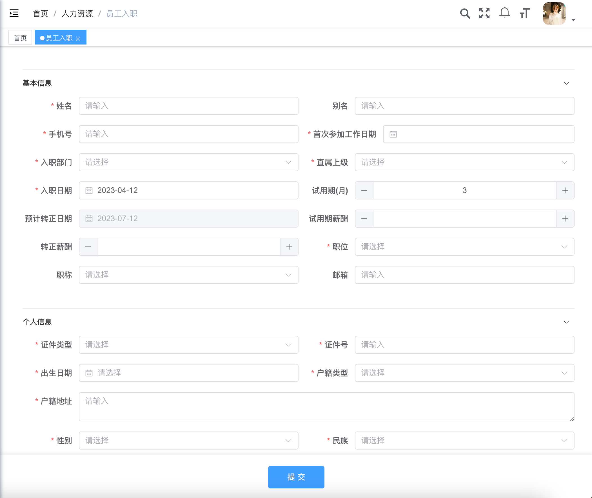
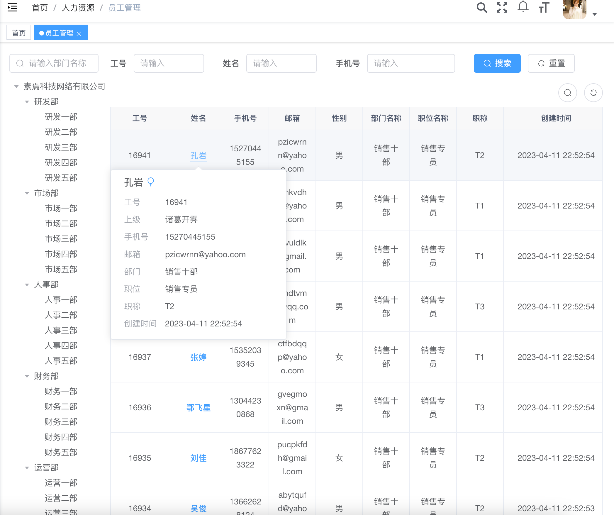

## 素焉OA管理系统
- 项目会不定时进行更新，建议⭐star⭐和👁️watch👁️一份。

### 系统介绍

- 素焉OA管理系统，使用技术：Spring Boot + Vue3，永久免费开源，开箱即用。
- 为了减少使用的组件，登录目前使用数据库方式，未采用Redis。
- 如果大家发现有问题或者BUG，请到Issue里面反馈，谢谢！

### 系统功能
|     | 模块   |   功能   | 描述                                                                                                                                                                                                                       |
|-----|------|:------:|--------------------------------------------------------------------------------------------------------------------------------------------------------------------------------------------------------------------------|
| 🚀  | 员工资料 |  基本资料  | 编号、姓名、性别、出生日期、身份证号、婚姻状况、民族、电子邮箱、手机号、联系地址、部门、职位、职称、分机号、直属上级、基本工资、聘用形式、最高学历、所属专业、毕业院校、入职时间、在职状态、工号、人员类型、合同期限。                                                                                                              |
| 🚀  |      |  高级资料  | 工资信息：工资月份、应发工资、工资明细、备注。 奖惩资料：奖惩时间、奖惩分数、奖惩原因、备注。 调动资料：调动时间、调前部门、调前职位、调动原因、调后部门、调后职位、备注。 调薪资料：调薪时间、调钱新增、调后薪资、调薪原因。                                                                                             |
| 🚀  | 公司管理 |  职位管理  | 编号、名称、角色、备注。                                                                                                                                                                                                             |
| 🚀  |      |  职称管理  | 编号、名称、备注。                                                                                                                                                                                                                |
| 🚀  |      |  部门管理  | 编号、名称、上级部门、负责人、备注。                                                                                                                                                                                                       |
| 🚀  |      |  员工入职  | 姓名、别名、手机号、入职部门、直属上级、入职日期、试用期、预计转正日期、试用期薪酬、转正薪酬、职位、职称、邮箱、首次参加工作日期、证件类型、证件号、出生日期、户籍类型、户籍地址、性别、民族、婚姻状况、政治面貌、社保账号、公积金账号、居住地址、学历信息(最高学历、毕业院校、毕业时间、所学专业)、银行卡(开户银行、银行卡号)、工作经历(单位名称、部门、职位、时间)、家庭信息(姓名、关系、联系方式)、紧急联系人(姓名、关系、联系方式) |
| 🚀  |      |  转正申请  | 申请人、工号、部门、入职时间、试用期、转正日期、职位、职称、试用期工作成果描述、自我综合评价（收获与不足）、未来工作计划和目标、对试用期间工作感受、对公司人际关系感受、对目前工作强度感受、对目前工作量感受、对目前工作环境感受。                                                                                                        |
| 🚀  |      |  离职申请  | 申请人、工号、部门、入职日期、最后工作日、离职原因(个人原因、家庭原因、发展原因、薪资原因、工作压力、无晋升机会、合同到期不续签、协议解除、试用期内辞退、违反公司条例、组织调整/裁员、其他)、离职原因备注。                                                                                                                  |
| 🚀  |      |  离职交接  | 申请人、工号、部门、入职日期、申请离职日期、实际离职日期、工作交接清单(工作事项、是否已交接)、工作交接人、交接时间。                                                                                                                                                              |
| 🚀  |      |  员工管理  | 工号、姓名、手机号、邮箱、性别、部门、职位、职称、创建时间。                                                                                                                                                                                           |
| 🚀  |      |  员工组   | 编号、员工id、组名称、备注、成员。                                                                                                                                                                                                       |
| 🚀  | 审批中心 |  审批员工  | 工号、姓名、手机号、邮箱、性别、申请时间。                                                                                                                                                                                                    |                                                                                                                  |
| 🚀  |      |  审批转正  | 申请人、工号、部门、入职日期、试用期、转正日期、职位、职称、试用期工作成果描述、自我综合评价（收获与不足）、未来工作计划和目标、对试用期间工作感受、对公司人际关系感受、对目前工作强度感受、对目前工作量感受、对目前工作环境感受。                                                                                                        |                                                                                                                  |
| 🚀  |      |  审批离职  | 申请人、工号、部门、申请日期、入职日期、申请离职日期、离职原因、离职原因备注、提交人、提交时间、流程状态、当前节点、当前负责人。                                                                                                                                                         |                                                                                                                  |
| 🚀  | 系统管理 | 入职审批配置 | 设置提交、审批、办理、抄送、结束。                                                                                                                                                                                                        |                                                                                                                  |
| 🚀  |      |  角色管理  | 编号、名称、权限、备注。                                                                                                                                                                                                             |
| 🚀  |      |  公司管理  | 编号、名称、是否隐藏手机号码、是否开启水印、备注。                                                                                                                                                                                                |
| 🚀  |      |  工资表   | 工资表单配置                                                                                                                                                                                                                   |
| 🚀  | 报表管理 |  员工信息  | 员工人数、员工状态、性别、最高学历、政治面貌、婚姻状况、部门。                                                                                                                                                                                          |
| 🚀  |      |  转正统计  |                                                                                                                                                                                                                          |
| 🚀  |      |  离职统计  |                                                                                                                                                                                                                          |

### 功能列表

|     | 模块   | 功能    | 是否完成 |
|-----|------|-------|:----:|
| 🚀  | 工作台  |       |  ❌   |
| 🚀  | 系统管理 | 系统配置  |  ❌   |
| 🚀  |      | 审批管理  |  ❌   |
| 🚀  |      | 操作日志  |  ❌   |
| 🚀  |      | 菜单管理  |  ✅   |
| 🚀  |      | 角色管理  |  ✅   |
| 🚀  | 人力资源 | 部门管理  |  ✅   |
| 🚀  |      | 职称管理  |  ✅   |
| 🚀  |      | 职位管理  |  ✅   |
| 🚀  |      | 员工入职  |  ✅   |
| 🚀  |      | 员工管理  |  ❌   |
| 🚀  |      | 人事变动  |  ❌   |
| 🚀  |      | 离职档案  |  ❌   |
| 🚀  | 行政管理 | 印章管理  |  ✅   |
| 🚀  |      | 车辆管理  |  ✅   |
| 🚀  |      | 会议室管理 |  ✅   |
| 🚀  | 日常办公 | 日常安排  |  ❌   |
| 🚀  |      | 日程日历  |  ❌   |
| 🚀  |      | 工作记录  |  ❌   |
| 🚀  |      | 工作日历  |  ❌   |
| 🚀  |      | 工作汇报  |  ❌   |
| 🚀  | 企业公告 | 公告类型  |  ❌   |
| 🚀  |      | 公告管理  |  ❌   |
| 🚀  | 办公中心 | 我发起的  |  ❌   |
| 🚀  |      | 我处理的  |  ❌   |
| 🚀  |      | 抄送我的  |  ❌   |

### 截图预览

